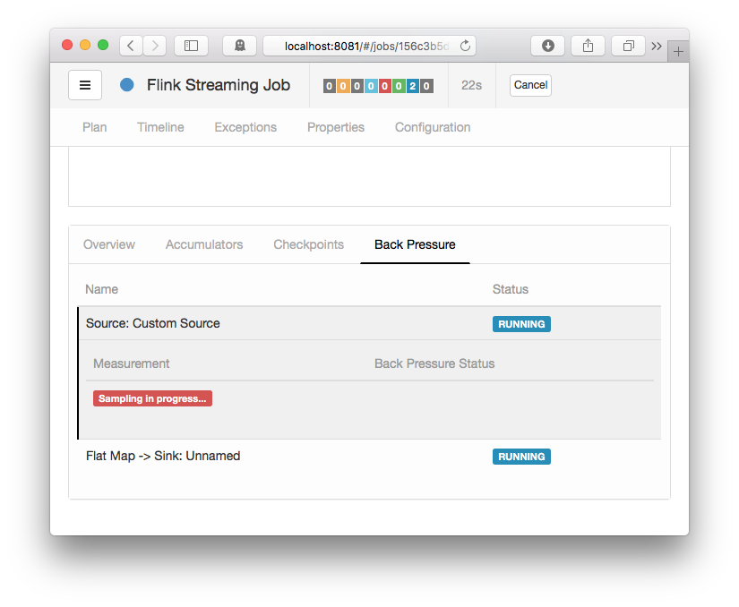

# 监测背压

> 译者：[flink.sojb.cn](https://flink.sojb.cn/)

Flink的Web界面提供了一个选项卡来监控正在运行的作业的背压行为。

## 背压

如果您看到任务的**背压警告**（例如`High`），这意味着它生成的数据比下游算子可以消耗的速度快。下游工作流程中的记录（例如从源到汇）和背压沿着相反的方向传播到流上方。

以一个简单的`Source -&gt; Sink`工作为例。如果您看到警告`Source`，这意味着`Sink`消耗数据的速度比`Source`生成速度慢。`Sink`正在向上游算子施加压力`Source`。

## 采样线程

背压监测通过反复获取正在运行的任务的堆栈跟踪样本来工作。JobManager会触发对作业`Thread.getStackTrace()`任务的重复调用。

如果示例显示任务线程卡在某个内部方法调用中（从网络堆栈请求缓冲区），则表示该任务存在背压。

默认情况下，JobManager为每个任务每50ms触发100个堆栈跟踪，以确定背压。您在Web界面中看到的比率告诉您在内部方法调用中有多少这些堆栈跟踪被卡住，例如`0.01`表示该方法中只有1个被卡住。

*   **OK**：0 &lt;= Ratio &lt;= 0.10
*   **LOW**：0.10 &lt;Ratio &lt;= 0.5
*   **HIGH**：0.5 &lt;Ratio &lt;= 1

为了不使用堆栈跟踪样本重载TaskManager，Web界面仅在60秒后刷新样本。

## 配置

您可以使用以下配置键配置JobManager的样本数：

*   `web.backpressure.refresh-interval`：不推荐使用可用统计信息并需要刷新的时间（默认值：60000,1分钟）。
*   `web.backpressure.num-samples`：用于确定背压的堆栈跟踪样本数（默认值：100）。
*   `web.backpressure.delay-between-samples`：堆栈跟踪样本之间的延迟以确定背压（默认值：50,50 ms）。

## 例

您可以在作业概述旁边找到“ _背压”_选项卡。

### 正在进行抽样

这意味着JobManager触发了正在运行的任务的堆栈跟踪示例。使用默认配置，大约需要5秒钟才能完成。

请注意，单击该行可触发此 算子的所有子任务的样本。

### 背压状态

如果您看到任务的状态**正常**，则表示没有背压指示。另一方面，**HIGH**意味着任务被加压。

