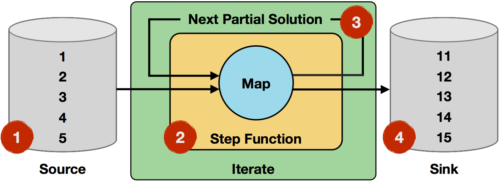
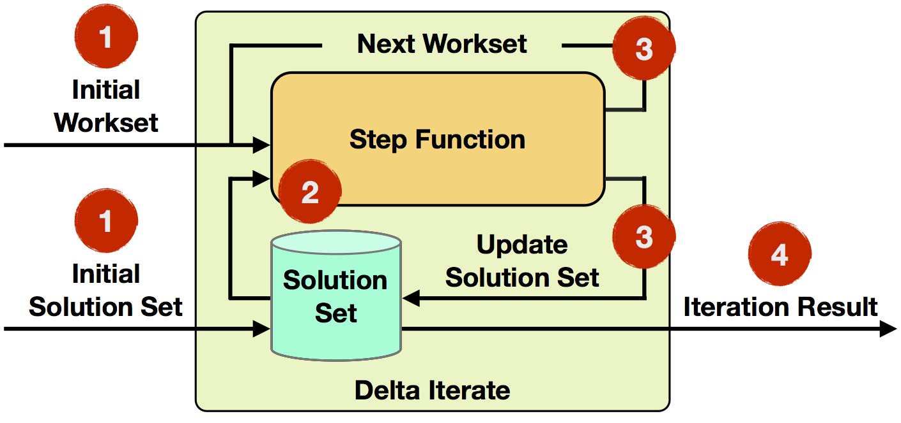
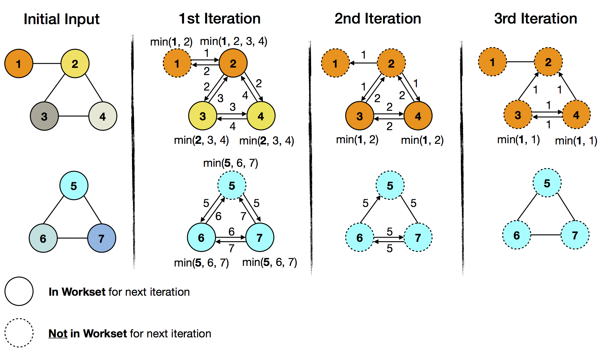
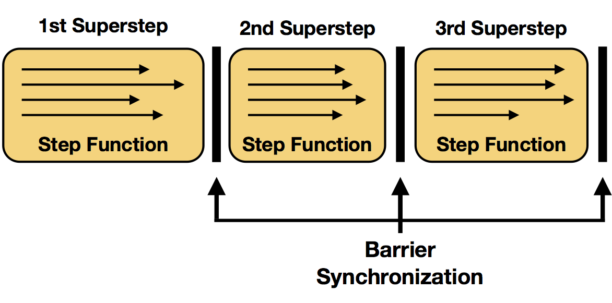

# 迭代

> 译者：[flink.sojb.cn](https://flink.sojb.cn/)


迭代算法出现在许多数据分析领域，例如_机器学习_或_图形分析_。这些算法对于实现大数据从数据中提取有意义信息的承诺至关重要。随着越来越有兴趣在非常大的数据集上运行这些算法，需要以大规模并行方式执行迭代。

Flink程序通过定义**步进函数**并将其嵌入到特殊的迭代 算子中来实现迭代算法。此 算子有两种变体：**Iterate**和**Delta Iterate**。两个 算子在当前迭代状态下重复调用步进函数，直到达到某个终止条件。

在这里，我们提供两种算子变体的背景并概述它们的用法。该[节目指南](index.html)介绍了如何实现算子在这两个Scala和Java。我们还通过Flink的图形处理API [Gelly](https://flink.sojb.cn/dev/libs/gelly/index.html)支持以**顶点为中心和聚集求和的迭代**。[](https://flink.sojb.cn/dev/libs/gelly/index.html)

下表提供了两个 算子的概述：

|  | 迭代 | Delta迭代 |
| --- | --- | --- |
| **迭代输入** | **部分解决方案** | **工作集**和**解决方案集** |
| **步函数** | 任意数据流 |
| **状态更新** | 下**一部分解决方案** | 下一个工作集 |
| | | **对解决方案集的更改** |
| **迭代结果** | 最后部分解决方案 | 上次迭代后的解决方案设置状态 |
| **终止** | **最大迭代次数**（默认） | **最大迭代次数或空工作集**（默认） |
| | 自定义聚合器收敛 | 自定义聚合器收敛 |

## 迭代 算子

在**迭代 算子**覆盖所述_迭代简单形式_：在每次迭代中，**阶梯函数**消耗**整个输入**（在_先前的迭代的结果_，或在_初始数据集_），并且计算**该部分解决方案的下一个版本**（例如`map`，`reduce`，`join`，等等。）。


1.  **迭代输入**：来自_数据源_或_先前 算子_的_第一次迭代的_初始输入。
2.  **步骤函数**：步进函数将在每次迭代中执行。它是由像算子的任意数据流`map`，`reduce`，`join`等，取决于手头的特定任务。
3.  **Next Partial Solution**：在每次迭代中，step函数的输出将反馈到_下一次迭代_。
4.  **迭代结果**：_最后一次迭代的_输出被写入_数据接收器_或用作_以下 算子的_输入。

有多个选项可指定迭代的**终止条件**：

*   **最大迭代次数**：没有任何其他条件，迭代将执行多次。
*   **自定义聚合器收敛**：迭代允许指定_自定义聚合器_和_收敛标准，_如sum聚合发出的记录数（聚合器），如果此数字为零则终止（收敛标准）。

您还可以考虑伪代码中的迭代 算子：


```
IterationState state = getInitialState();

while (!terminationCriterion()) {
	state = step(state);
}

setFinalState(state);
```


有关详细信息和代码示例，请参阅**[编程指南](index.html)** 。

### 示例：递增数字

在以下示例中，我们**迭代地递增一组数字**：



1.  **迭代输入**：初始输入从数据源读取和由五个单字段记录（整数`1`到`5`）。
2.  **步进函数**：步进函数是单个`map` 算子，它将整数字段从`i`增加到`i+1`。它将应用于输入的每个记录。
3.  **Next Partial Solution**：step函数的输出将是map 算子的输出，即具有递增整数的记录。
4.  **迭代结果**：经过十次迭代，最初的数字将被增加十倍，造成整数`11`来`15`。


```
// 1st           2nd                       10th
map(1) -> 2      map(2) -> 3      ...      map(10) -> 11
map(2) -> 3      map(3) -> 4      ...      map(11) -> 12
map(3) -> 4      map(4) -> 5      ...      map(12) -> 13
map(4) -> 5      map(5) -> 6      ...      map(13) -> 14
map(5) -> 6      map(6) -> 7      ...      map(14) -> 15
```


需要注意的是**1**，**2**，和**4**可以是任意的数据流。

## Delta迭代算子

该**增量迭代算子**覆盖的情况下，**增量迭代**。增量迭代**有选择地修改**其**解决方案的****数据元**并演化解决方案，而不是完全重新计算它。

在适用的情况下，这会导致**更高效的算法**，因为解决方案集中的每个数据元都不会在每次迭代中发生变化。这样可以**专注于**解决方案**的热部件**，并**保持冷部件不受影响**。通常，大多数解决方案相对较快地冷却，后来的迭代仅在一小部分数据上运行。



1.  **迭代输入**：从_数据源_或_先前的 算子_读取初始工作集和解决方案集作为第一次迭代的输入。
2.  **步骤函数**：步进函数将在每次迭代中执行。它是由像算子的任意数据流`map`，`reduce`，`join`等，取决于手头的特定任务。
3.  **下**_一个工作集_**/更新解决方案集**：_下一个工作集_驱动迭代计算，并将反馈到_下一个迭代_。此外，解决方案集将被更新并隐式转发（不需要重建）。两个数据集都可以由步进函数的不同 算子更新。
4.  **迭代结果**：在_最后一次迭代之后_，_解决方案集_被写入_数据接收器_或用作_以下 算子的_输入。

delta迭代的默认**终止条件**由**空工作集收敛标准**和**最大迭代次数指定**。当生成的_下一个工作集_为空或达到最大迭代次数时，迭代将终止。还可以指定**自定义聚合器**和**收敛标准**。

您还可以考虑伪代码中的迭代 算子：


```
IterationState workset = getInitialState();
IterationState solution = getInitialSolution();

while (!terminationCriterion()) {
	(delta, workset) = step(workset, solution);

	solution.update(delta)
}

setFinalState(solution);
```


有关详细信息和代码示例，请参阅**[编程指南](index.html)**。

### 示例：在图表中传播最小值

在以下示例中，每个顶点都有一个**ID**和一个**着色**。每个顶点将其顶点ID传播到相邻顶点。该**目标**是_最小ID分配给子图的每个顶点_。如果接收的ID小于当前的ID，则它将变为具有接收到的ID的顶点的颜色。其中一个应用可以在_社区分析_或_连通组件_计算中找到。



的**初始输入**被设置为**两个工作集和溶液组。**在上图中，颜色可视化**解决方案集**的**演变**。每次迭代时，最小ID的颜色在相应的子图中展开。同时，每次迭代，工作量（交换和比较顶点ID）都会Reduce。这对应于**工作集的大小减小**，其在三次迭代之后从所有七个顶点变为零，此时迭代终止。在**重要的观察**是，_较低的子收敛上半之前_不和增量迭代能够与工作集抽象捕捉到这一点。

在上部子图**ID 1**（_橙色_）中是**最小ID**。在第**一次迭代中**，它将传播到顶点2，随后将其颜色更改为橙​​色。顶点3和4将接收**ID 2**（_黄色_）作为其当前最小ID并更改为黄色。因为_顶点1_的颜色在第一次迭代中没有改变，所以可以在下一个工作集中跳过它。

在较低的子图中，**ID 5**（_青色_）是**最小ID**。下子图的所有顶点将在第一次迭代中接收它。同样，我们可以跳过下一个工作集的未更改顶点（_顶点5_）。

在**第二次迭代中**，工作集大小已经从七个数据元Reduce到五个数据元（顶点2,3,4,6和7）。这些是迭代的一部分，并进一步传播其当前的最小ID。在此迭代之后，下部子图已经收敛（图的**冷部分**），因为它在工作集中没有数据元，而上半部分需要对剩余的两个工作集数据元（顶点）进行进一步迭代（图的**热部分**） 3和4）。

当**第三次迭代**后工作集为空时，迭代**终止**。


## 超级同步

我们将迭代 算子的阶梯函数的每次执行称为_单次迭代_。在并行设置中，在迭代状态的不同分区上**并行评估步骤函数的多个实例**。在许多设置中，对所有并行实例的步骤函数的一个评估形成所谓的**超级步骤**，其也是同步的粒度。因此，迭代的_所有_并行任务都需要在初始化下一个超级步骤之前完成超级步骤。**终止标准**也将在超级障碍评估。



