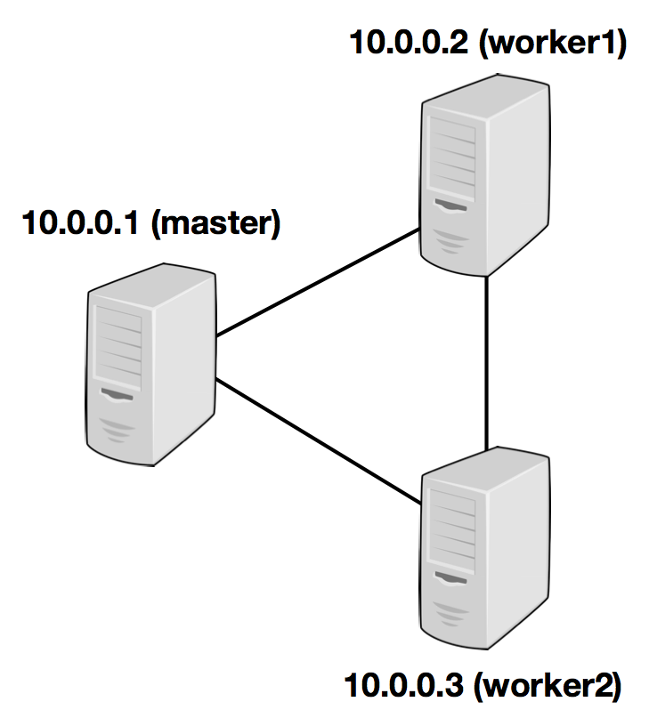

# 独立群集

> 译者：[flink.sojb.cn](https://flink.sojb.cn/)


此页面提供有关如何在_静态_（但可能是异构）群集上以_完全分布式方式_运行Flink的说明。

## 要求

### 软件要求

Flink可在所有_类UNIX环境中运行_，例如**Linux**，**Mac OS X**和**Cygwin**（适用于Windows），并期望群集由**一个主节点**和**一个或多个工作节点组成**。在开始设置系统之前，请确保**在每个节点上**安装了以下软件：

*   **Java 1.8.x**或更高版本，
*   **ssh**（必须运行sshd才能使用管理远程组件的Flink脚本）

如果您的群集不满足这些软件要求，则需要安装/升级它。

在所有群集节点上使用无**密码SSH**和 **相同的目录结构**将允许您使用我们的脚本来控制所有内容。

### `JAVA_HOME` 配置

Flink要求在`JAVA_HOME`主节点和所有工作节点上设置环境变量，并指向Java安装的目录。

您可以`conf/flink-conf.yaml`通过`env.java.home`键设置此变量。

## Flink设置

转到[下载页面](http://flink.apache.org/downloads.html)并获取可立即运行的包。确保选择**与您的Hadoop版本匹配**的Flink包。如果您不打算使用Hadoop，请选择任何版本。

下载最新版本后，将存档复制到主节点并解压缩：


```
tar xzf flink-*.tgz
cd flink-*
```


### 配置Flink

解压缩系统文件后，需要通过编辑_conf / flink-conf.yaml_为集群配置Flink 。

将`jobmanager.rpc.address`Keys设置为指向主节点。您还应该通过设置`jobmanager.heap.mb`和`taskmanager.heap.mb`键来定义允许JVM在每个节点上分配的最大主内存量。

这些值以MB为单位。如果某些工作节点有更多主内存要分配给Flink系统，则可以通过`FLINK_TM_HEAP`在这些特定节点上设置环境变量来覆盖默认值。

最后，您必须提供集群中所有节点的列表，这些节点将用作工作节点。因此，与HDFS配置类似，编辑文件_conf / slaves_并输入每个工作节点的IP /主机名。每个工作节点稍后将运行TaskManager。

以下示例说明了具有三个节点（IP地址从_10.0.0.1_ 到_10.0.0.3_以及主机名_master_，_worker1_，_worker2_）的设置，并显示了配置文件的内容（需要在所有计算机上的相同路径上访问） ）：



/ path / to / **flink / conf /
flink-conf.yaml**

```
jobmanager.rpc.address：10.0.0.1
```

/ path / to / **flink /
conf / slaves**

```
10.0.0.2
10.0.0.3
```

Flink目录必须在同一路径下的每个worker上都可用。您可以使用共享NFS目录，也可以将整个Flink目录复制到每个工作节点。

有关详细信息和其他配置选项，请参阅[配置页面](https://flink.sojb.cn/config.html)。

尤其是，

*   每个JobManager（`jobmanager.heap.mb`）的可用内存量，
*   每个TaskManager（`taskmanager.heap.mb`）的可用内存量，
*   每台机器的可用CPU数量（`taskmanager.numberOfTaskSlots`），
*   集群中的CPU总数（`parallelism.default`）和
*   临时目录（`taskmanager.tmp.dirs`）

是非常重要的配置值。

### 启动Flink

以下脚本在本地节点上启动JobManager，并通过SSH连接到_从属_文件中列出的所有工作节点，以在每个节点上启动TaskManager。现在您的Flink系统已启动并正在运行。在本地节点上运行的JobManager现在将接受配置的RPC端口上的作业。

假设您在主节点上并在Flink目录中：


```
bin/start-cluster.sh
```


要停止Flink，还有一个`stop-cluster.sh`脚本。

### 将JobManager / TaskManager实例添加到群集

您可以使用`bin/jobmanager.sh`和`bin/taskmanager.sh`脚本将JobManager和TaskManager实例添加到正在运行的集群中。

#### 添加JobManager


```
bin/jobmanager.sh ((start|start-foreground) cluster)|stop|stop-all
```


#### 添加TaskManager


```
bin/taskmanager.sh start|start-foreground|stop|stop-all
```


确保在要启动/停止相应实例的主机上调用这些脚本。

